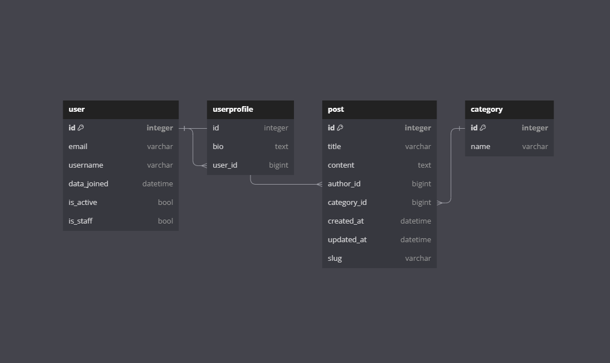

## 1. 프로젝트 개요
### 1.1 목표
- Class Based View를 활용한 블로그 플랫폼 개발

### 1.2 일정
- 2023-07-17 ~ 2023-07-20

### 1.3 요구 사항
- 0단계 (완료): Admin 페이지를 이용한 게시글 읽기 및 메인페이지 구현
- 1단계 (완료): 블로그 CRUD 기능 구현
    - 게시글 검색 기능 미구현
- 2단계 (구현 중): 로그인/회원가입 기능 구현
- 3단계 (미구현): 추가 기능 및 배포

## 2. 개발 환경
- Python 3.11.3
- Packages
```
asgiref==3.7.2
Django==4.2.3
django-environ==0.10.0
python-decouple==3.8
sqlparse==0.4.4
typing_extensions==4.7.1
tzdata==2023.3
```

## 3. 프로젝트 구조
### 3.1 데이터베이스 모델링


### 3.2 폴더 트리
```
📦blog
 ┣ 📂__pycache__
 ┃ ┣ 📜env.cpython-310.pyc
 ┃ ┣ 📜settings.cpython-310.pyc
 ┃ ┣ 📜urls.cpython-310.pyc
 ┃ ┣ 📜views.cpython-310.pyc
 ┃ ┣ 📜wsgi.cpython-310.pyc
 ┃ ┗ 📜__init__.cpython-310.pyc
 ┣ 📜asgi.py
 ┣ 📜env.py
 ┣ 📜settings.py
 ┣ 📜urls.py
 ┣ 📜views.py
 ┣ 📜wsgi.py
 ┗ 📜__init__.py
📦posts
 ┣ 📂migrations
 ┃ ┣ 📂__pycache__
 ┃ ┃ ┣ 📜0001_initial.cpython-310.pyc
 ┃ ┃ ┣ 📜0002_initial.cpython-310.pyc
 ┃ ┃ ┣ 📜0003_alter_post_slug.cpython-310.pyc
 ┃ ┃ ┗ 📜__init__.cpython-310.pyc
 ┃ ┣ 📜0001_initial.py
 ┃ ┣ 📜0002_initial.py
 ┃ ┣ 📜0003_alter_post_slug.py
 ┃ ┗ 📜__init__.py
 ┣ 📂__pycache__
 ┃ ┣ 📜admin.cpython-310.pyc
 ┃ ┣ 📜apps.cpython-310.pyc
 ┃ ┣ 📜models.cpython-310.pyc
 ┃ ┣ 📜urls.cpython-310.pyc
 ┃ ┣ 📜views.cpython-310.pyc
 ┃ ┗ 📜__init__.cpython-310.pyc
 ┣ 📜admin.py
 ┣ 📜apps.py
 ┣ 📜models.py
 ┣ 📜tests.py
 ┣ 📜urls.py
 ┣ 📜views.py
 ┗ 📜__init__.py
📦templates
 ┣ 📜base.html
 ┣ 📜home.html
 ┣ 📜login.html
 ┣ 📜post_create.html
 ┣ 📜post_delete.html
 ┣ 📜post_detail.html
 ┣ 📜post_list.html
 ┣ 📜post_update.html
 ┣ 📜profile.html
 ┣ 📜profile_delete.html
 ┣ 📜profile_update.html
 ┗ 📜signup.html
📦users
 ┣ 📂migrations
 ┃ ┣ 📂__pycache__
 ┃ ┃ ┣ 📜0001_initial.cpython-310.pyc
 ┃ ┃ ┣ 📜0002_userprofile.cpython-310.pyc
 ┃ ┃ ┗ 📜__init__.cpython-310.pyc
 ┃ ┣ 📜0001_initial.py
 ┃ ┣ 📜0002_userprofile.py
 ┃ ┗ 📜__init__.py
 ┣ 📂__pycache__
 ┃ ┣ 📜admin.cpython-310.pyc
 ┃ ┣ 📜apps.cpython-310.pyc
 ┃ ┣ 📜models.cpython-310.pyc
 ┃ ┣ 📜urls.cpython-310.pyc
 ┃ ┣ 📜views.cpython-310.pyc
 ┃ ┗ 📜__init__.cpython-310.pyc
 ┣ 📜admin.py
 ┣ 📜apps.py
 ┣ 📜models.py
 ┣ 📜tests.py
 ┣ 📜urls.py
 ┣ 📜views.py
 ┗ 📜__init__.py
 ┣ 📜.env
 ┣ 📜.gitignore
 ┣ 📜db.sqlite3
 ┣ 📜image.png
 ┣ 📜manage.py
 ┣ 📜README.md
 ┗ 📜requirements.txt
 ```
